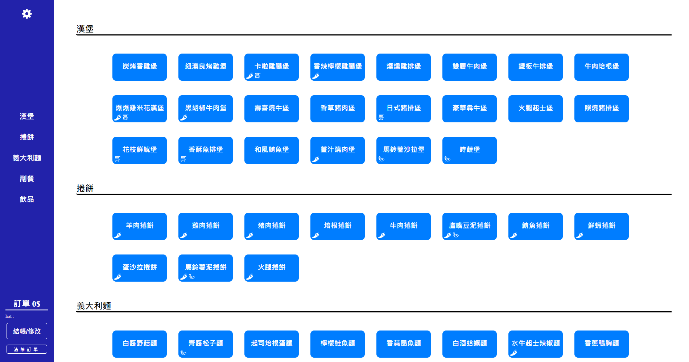
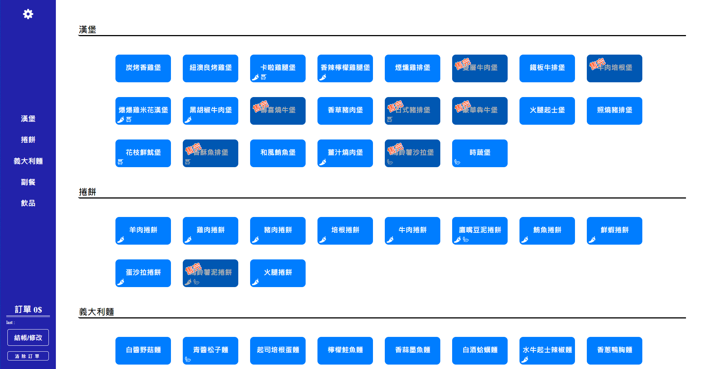
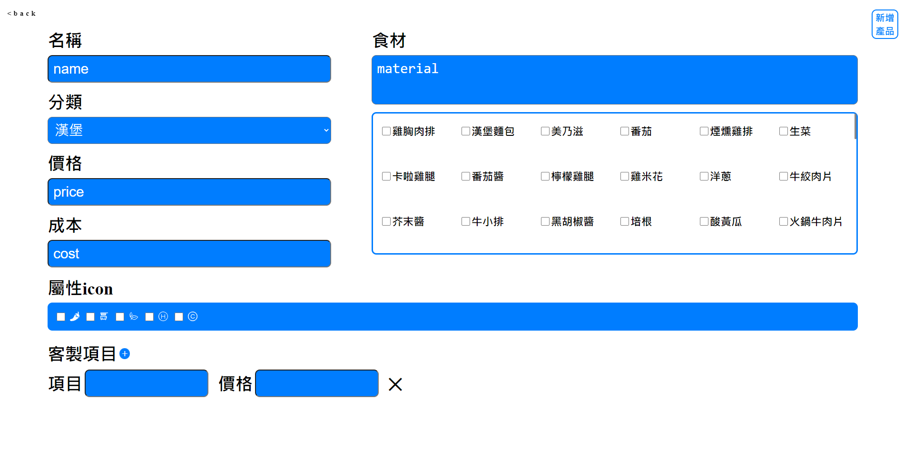
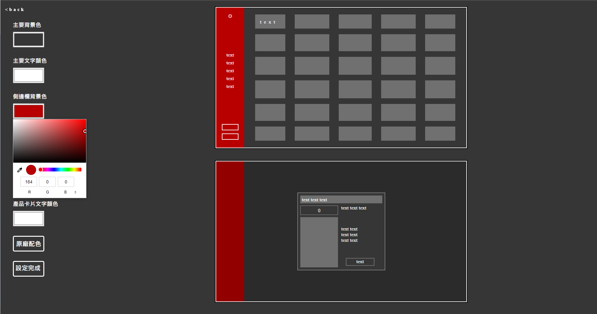

<details>
  <summary>目錄</summary>
  <ol>
    <li><a href="#POS機系統">POS機系統</a></li>
    <li><a href="#專案功能">專案功能</a></li>
    <li><a href="#環境建置與需求">環境建置與需求</a></li>
    <li><a href="#安裝與執行步驟">安裝與執行步驟</a></li>
    <li><a href="#專案畫面">專案畫面</a></li>
  </ol>
</details>

&nbsp;
# **POS機系統**

Point of sale 銷售時點情報系統

&nbsp;
## **專案功能**

* 使用者可以方便的進行點餐服務：
    * 利用左側功能快速切換分類
    * 於左下角確認點餐狀況，或清除訂單
    * 餐點帶有icon可以知道素食、辣與不辣等屬性
    * 每份餐點都可撰寫客製化備註

* 使用者可以設定缺貨狀況：
    * 選擇缺貨原物料來停售相關的商品
    * 利用快速鍵進行一鍵補貨
    * 缺貨資料儲存於瀏覽器，不會影響其他機台之使用者

* 使用者可以修改產品資料:
    * 編輯、修改與新增詳細資料
    * 刪除產品時將在確認避免誤刪

* 使用者可以自訂客製化的主題顏色:
    * 依照喜好選擇顏色時有模擬畫面可預覽
    * 可根據不同裝潢風格進行設計，而不影響其他機台之使用者

&nbsp;
## **環境建置與需求**

* [Node.js](https://nodejs.org/en/) - v16.15.1
* [MongoDB](https://www.mongodb.com/zh-cn/cloud/atlas/efficiency) - Atlas

&nbsp;
## **安裝與執行步驟**


１.Clone 專案

```properties
git clone https://github.com/RNovice/POS_System
```

２.安裝node套件

```properties
npm install
```

３.設定MongoDB資料庫
> 設定環境變數 MONGODB_URI 為資料庫URI

> 或於config資料夾 mongoose.js 第3行 修改連線資料庫
```js
mongoose.connect('資料庫URI', { useNewUrlParser: true, useUnifiedTopology: true })
```
> 載入種子資料

利用終端機載入種子資料

```properties
npm run seed
```

４.執行專案
> node
```properties
npm run start
```

> nodemon(視需求)

```properties
npm run dev
```

５.在瀏覽器上瀏覽專案

```
http://localhost:3000
```

專案啟動成功時，終端機輸出
```
Listening on http://localhost:3000
```
資料庫連接成功時，終端機輸出
```
mongodb connected
```

６.[瀏覽佈署於heroku的專案](http://posssystem.herokuapp.com/welcome)
```
http://posssystem.herokuapp.com/welcome
```
&nbsp;
## **專案畫面**

點餐功能


原物料缺貨功能


產品編輯功能


客製化主題顏色功能



https://user-images.githubusercontent.com/89009561/182818582-50c53c45-79d8-4a07-9f76-98781ad3755b.mp4

